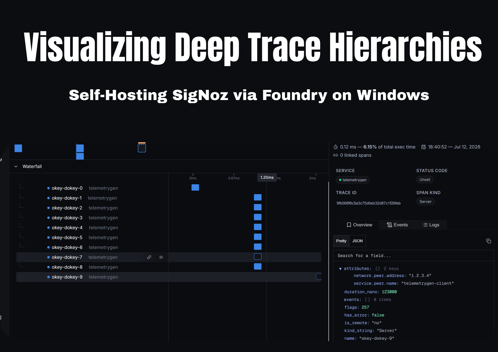

#  Deep Tracing Locally on Windows: Self-Hosted SigNoz via Foundry

A lightweight 0-cloud local observability sandbox for the Agents of SigNoz Hackathon. This project demonstrates a method of circumventing typical observational cloud costs while being able to fully self-host a 12-container observability backend running on Windows with **foundry-rs/foundry**, giving us deep tracing of multi-tier microservice call trees at the level of microsecond resolution.



## Read the Full Technical Blog Post
For technical details on the implementation specifics, Windows-specific Docker networking footguns, and more, read the full post on Dev.to:
 [Read the dev.to Article here](INSERT_YOUR_DEVTO_LINK_HERE)
---

##  Why This Project?
* **Zero-Cloud Local Sandbox:** Run ClickHouse and the full SigNoz backend locally to avoid incurring cloud costs for ingesting traces
* **Deep Trace Hierarchies:** Generation and visualization of 15-level deep execution trees (`okey-dokey-0` -> `okey-dokey-15`) via `telemetrygen` and OpenTelemetry
* **Windows Networking Bridged:** Windows-specific fix to allow container -> host OTLP communication with `--add-host host.docker.internal:host-gateway`
* **Proactive Alerting Out-of-the-Box:** Active monitoring thresholds for P99 latency (`~1.85 ms`) and error rate (`>5%`) for trace spans
---
##  Requirements

* **OS:** Windows 10/11 (WSL2 or Hyper-V)
* **Container Engine:** Docker Desktop
* **Orchestration:** **Foundry CLI**
---

##  Quickstart

### 1. Clone the Repository
```bash
git clone https://github.com/rahulchandra2004/signoz-foundry-windows.git

cd signoz-foundry-windows
```

### Launch the SigNoz Backend via Foundry
Use the included Foundry manifest to spin up the local observability stack (including ClickHouse, Query Service, OTLP Receivers, and Frontend):

```bash
foundry up -f casting.yaml
```

Wait a few minutes for all 12 containers and the ClickHouse database to initialize. Once ready, access the UI at http://localhost:8383.
---
### Stream Synthetic Deep Trace Telemetry
Run the included Windows PowerShell script to start streaming synthetic telemetry directly into port 4317 with a 15-span child hierarchy:

```bash
.\generate-telemetry.ps1
```
---
### Explore the Observability Stack
* **Traces Explorer:** Navigate to the Traces tab to view nested cascading waterfall flamegraphs.
* **APM Metrics:** Check the Application Health metrics to observe live throughput (~1.75 ops/s) and latency distributions.
* **Logs Explorer:** Filter structured JSON log payloads correlated directly with trace IDs.
* **Alerts Engine:** Review proactive metric-based threshold alerts configured in the UI Query Builder.
---
### Tech Stack
* **Observability Backend:** SigNoz
* **Ingestion Standard:** OpenTelemetry (OTel / OTLP)
* **Database / Storage:** ClickHouse
* **Container Orchestration:** Foundry / Docker
* **Operating System:** Windows


